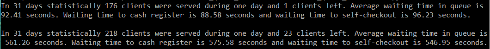
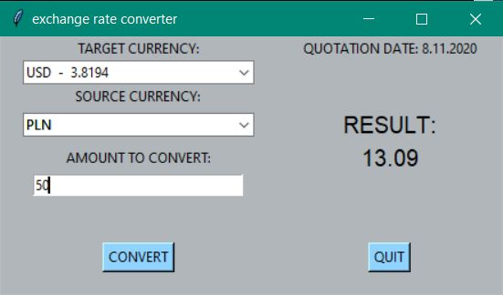
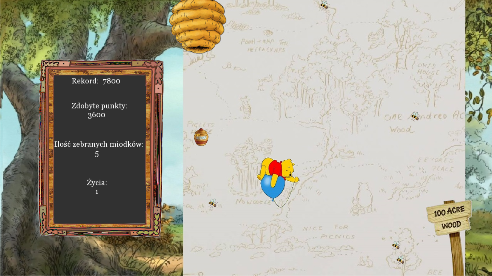
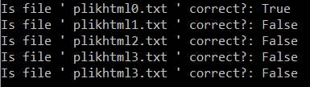
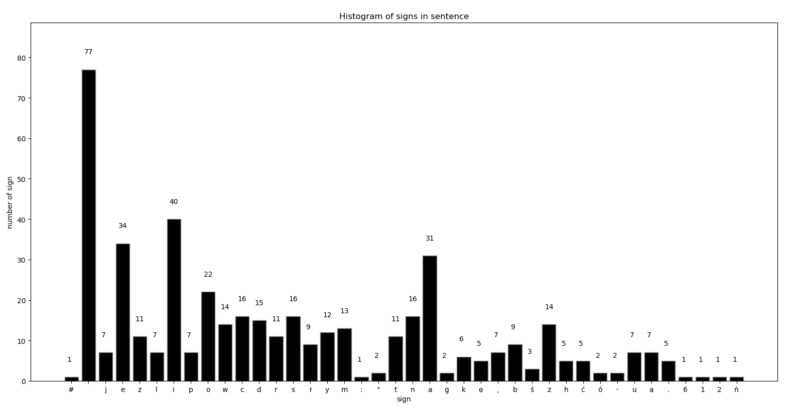
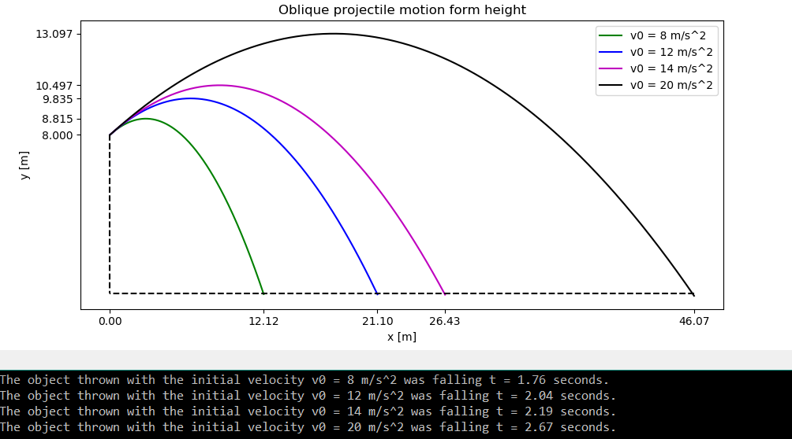
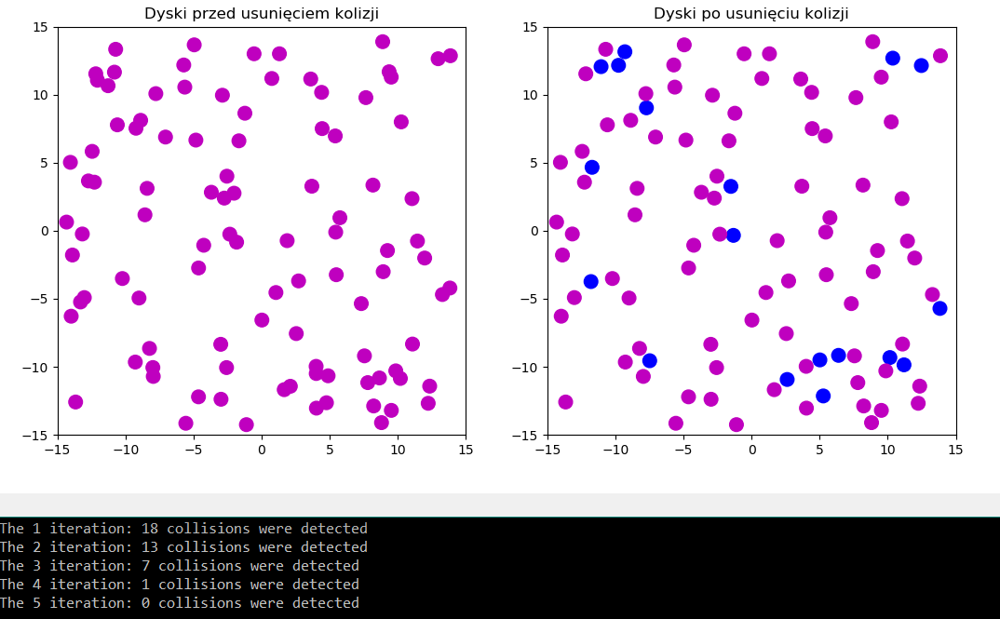

# Python-programs

# [Program 1: Drugstore Simulation](https://github.com/JuneMaths/Python-programs/blob/main/Drugstore_queue_simulation/Drugstore_queue_simulation.py)

Let's assume that we are in a Rossmann. There are two opportunities. You can pay in cash register or in self-checkout. Clients come to the shop and get products. In average one customer takes from 1 to 15 products. There is only one queue to both checkout desks. If one of them is avaiable, customer comes and pay. In average in rush hours (15.00-18.00) there is around 60 peopole per hour which gives 1 person per 60 second.

- In cash register paying takes 60 seconds and 1 product per 3 second. 
(paying time + [getting product, beep, puting product]). 

- In self-checkout paying takes 80 seconds and 1 product per 4 second. 
(paying time + [getting product, looking for barcode, beep, putting product]) 

Statistically we are more willing to choose cash register, because self-checkout is still unknown technology for most of people. What is the averge time of waiting to pay? Is it necessary to buy a new self-checkout or employ new cashier?

We can notice that avarage time the customer spends in waiting queue for both cash register and self-checkout is less than 2 minutes which is not too much. But if we consider that Rossmann ususally reduce prices twice a year our model isn't right. In that time number of customers incrise to 1 client in 45 seconds. 

After applying this model we can notice that there are too many customes to serve left. And waiting time in queue incrises to around 8 minutes. In conlusion the shop sholud add a cashier diuring this time or sholud buy additional self-checkout.

# [Program 2: Exchange rate converter](https://github.com/JuneMaths/Python-programs/blob/main/NBP_converter/nbp_converter.py)
The program helps to calculate currency exchange. This displays the gui window where you can calculate the final amount after entering all the values. It retrieves current data from the website of the Polish National Bank (NBP)

# [Program 3: Winnie the Pooh Game](https://github.com/JuneMaths/Python-programs/blob/main/Game%20Winnie%20the%20Pooh/game.py)
The goal of the game is to help the always hungry Winnie the Pooh get more and more honey. However, you have to watch out for the bees and avoid them during the flight. 
You score points for each honey you caught (The number of points earn: the amount of honey collected * the number of lives left) and lives are deducted for each hit bee. You only have three lives. 
If you run out of lives in the game and you managed to beat the record, your score is saved in the file with the highest scores.

# [Program 4: Missing tag in HTML file](https://github.com/JuneMaths/Python-programs/blob/main/Tag_missing_in_HTML/HTML_tags_missing.py)
The function checks the syntax of the HTML document for missing closing tags. It takes one argument which is HTML file and return True if program is correct or False if there is a missing tag.

# [Program 5: Position in the text](https://github.com/J-data/Python-programs/blob/main/place_of_sign_in_string.py)
The program finds a position of any sign in a sentence. 
It returns a number of the sign in the sentence and positions of the sign.
It plots histogram of numbers of every signs in the sentence. 

Example of a sentence:
Jeżeli powiecie dorosłym: "Dowodem istnienia Małego Księcia jest to, że był śliczny, że śmiał się i że chciał mieć baranka, a jeżeli chce się mieć baranka, to dowód, że się istnieje" - wówczas wzruszą ramionami i potraktują was jak dzieci. Lecz jeżeli im powiecie, że przybył z planety B-612, uwierzą i nie będą zadawać niemądrych pytań. Oni są właśnie tacy. Nie można od nich za dużo wymagać. Dzieci muszą być bardzo pobłażliwe w stosunku do dorosłych. 

# [Program 6: Oblique projectile motion without air resistance](https://github.com/JuneMaths/Python-programs/blob/main/oblique_projectile_motion.py)
The program calculate a trajectory of oblique projectile motion without air resistance. The model takes into account change of the gravity depending on the change in height. It plots the result on the graph and returns the falling time, maximum height and the throw range.

# [Program 7: Disks board](https://github.com/JuneMaths/Python-programs/tree/main/Disks_board)
The program draws 100 random disks of the same radius on a 15x15 board. It checks if there is any collision between two disks. If the answer is true. It moves a disk, changes it's color and checks again. 

